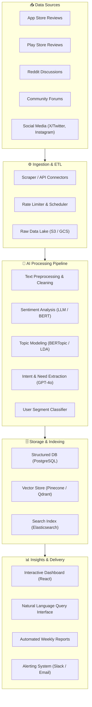
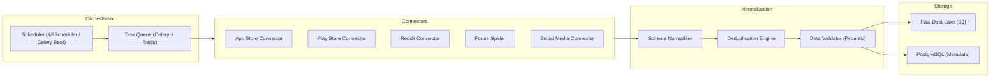
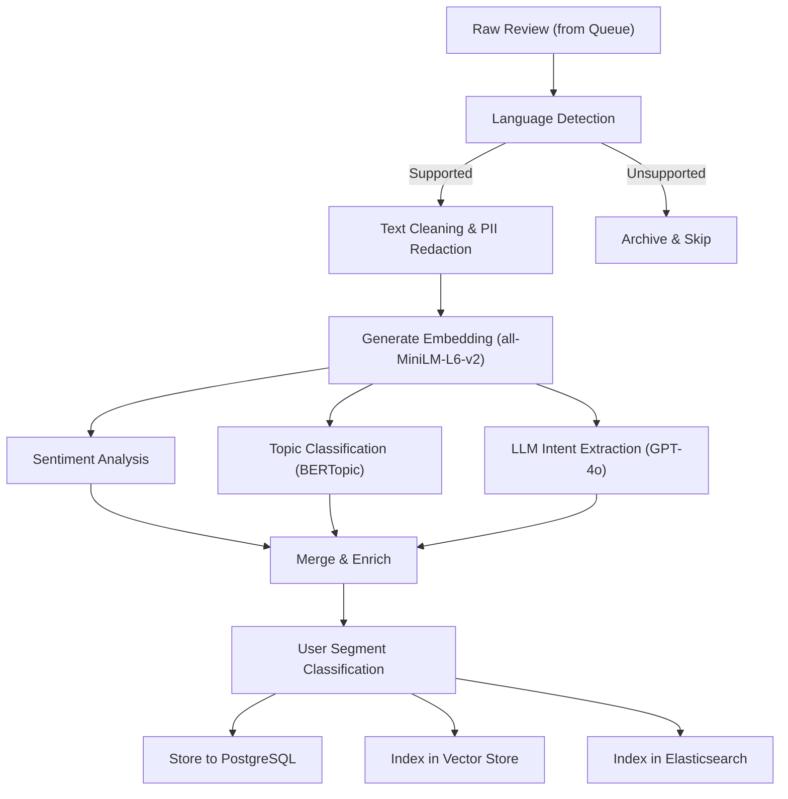
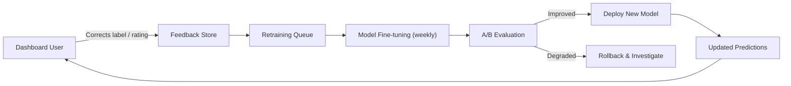

# Architecture: AI-Powered Review Discovery Engine for Gaana

> A phase-wise technical blueprint for building an AI system that aggregates, analyzes, and extracts actionable product insights from user feedback across multiple channels—to enhance music discovery and reduce repetitive listening behavior.

---

## High-Level System Overview



---

## Phase 1: Foundation & Infrastructure Setup
**Duration:** ~1–2 Weeks  
**Goal:** Establish the project scaffolding, development environment, CI/CD pipeline, and core infrastructure.

### 1.1 Project Scaffolding
| Item | Detail |
|---|---|
| **Monorepo Structure** | `gaana-discovery-engine/` with `ingestion/`, `processing/`, `api/`, `dashboard/`, `infra/`, `docs/` |
| **Language & Runtime** | Python 3.11+ (backend & ML), Node.js 20+ (dashboard) |
| **Package Management** | `uv` / `poetry` for Python, `pnpm` for JS |
| **Containerization** | Docker + Docker Compose for local dev |

### 1.2 Infrastructure Provisioning
| Component | Technology | Purpose |
|---|---|---|
| **Cloud Provider** | AWS / GCP | Compute, storage, networking |
| **Object Storage** | S3 / GCS | Raw data lake for ingested reviews |
| **Primary Database** | PostgreSQL (via RDS / Cloud SQL) | Structured review metadata, processed results |
| **Vector Database** | Pinecone (managed) | Semantic search over review embeddings |
| **Message Queue** | Redis Streams / RabbitMQ | Async job orchestration between pipeline stages |
| **CI/CD** | GitHub Actions | Automated testing, linting, deployment |

### 1.3 Deliverables
- [ ] Monorepo initialized with folder structure and linting configs
- [ ] Docker Compose file for local development (Postgres, Redis)
- [ ] CI pipeline running on every PR (lint + unit tests)
- [ ] Infrastructure-as-Code templates (Terraform / Pulumi) for cloud resources
- [ ] Environment variable management via `.env` + secrets manager (including Pinecone API keys)

---

## Phase 2: Data Ingestion & Collection
**Duration:** ~2–3 Weeks  
**Goal:** Build robust, fault-tolerant scrapers and API connectors to continuously ingest user reviews and discussions from all target channels.

### 2.1 Source Connectors

| Source | Method | Key Considerations |
|---|---|---|
| **Apple App Store** | `app-store-scraper` / iTunes RSS API | Rate limits, pagination, language filtering |
| **Google Play Store** | `google-play-scraper` / Serpapi | Continuation tokens, review sorting |
| **Reddit** | Reddit API (OAuth2) via `asyncpraw` | Subreddit targeting (`r/gaana`, `r/indianmusic`, etc.), comment threading |
| **Community Forums** | Custom Scrapy spiders | Site-specific selectors, politeness policies |
| **Social Media (X)** | X API v2 (Academic/Basic) | Keyword search, hashtag tracking, reply threads |

### 2.2 Ingestion Pipeline Architecture



### 2.3 Unified Review Schema

```json
{
  "id": "uuid-v4",
  "source": "play_store | app_store | reddit | forum | twitter",
  "source_id": "original-platform-id",
  "author": "anonymized-username",
  "content": "Full text of the review or post",
  "rating": 4,
  "language": "en",
  "timestamp": "2026-06-20T14:30:00Z",
  "metadata": {
    "app_version": "9.2.1",
    "device": "Samsung Galaxy S24",
    "os_version": "Android 15",
    "subreddit": null,
    "thread_id": null
  },
  "ingested_at": "2026-06-20T15:00:00Z",
  "processing_status": "pending"
}
```

### 2.4 Deliverables
- [ ] Working connectors for all 5 source channels
- [ ] Scheduled ingestion jobs (configurable frequency per source)
- [ ] Deduplication logic (content hash + source_id)
- [ ] Data validation with Pydantic models
- [ ] Raw data persisted to object storage + metadata in Postgres
- [ ] Monitoring dashboard for ingestion health (success/failure rates)

---

## Phase 3: AI Processing & Analysis Pipeline
**Duration:** ~3–4 Weeks  
**Goal:** Build the core intelligence layer that transforms raw reviews into structured, queryable insights using NLP and LLMs.

### 3.1 Text Preprocessing

| Step | Technique | Purpose |
|---|---|---|
| Language Detection | `langdetect` / `fasttext` | Filter to supported languages (EN, HI, etc.) |
| Cleaning | Regex + custom rules | Remove emojis (preserve sentiment-carrying ones), URLs, HTML entities |
| Normalization | Lowercasing, lemmatization | Standardize text for downstream models |
| PII Redaction | `presidio` / regex patterns | Remove emails, phone numbers, usernames |

### 3.2 Core Analysis Models

#### A. Sentiment Analysis
| Approach | Model | Output |
|---|---|---|
| **Fine-tuned Classifier** | `distilbert-base-uncased-finetuned-sst-2` | Positive / Negative / Neutral + confidence score |
| **Aspect-Based Sentiment** | Custom fine-tuned on Gaana review data | Sentiment per topic (e.g., "recommendations: negative", "UI: positive") |

#### B. Topic Modeling & Categorization
| Approach | Model | Output |
|---|---|---|
| **Dynamic Topic Modeling** | BERTopic with `all-MiniLM-L6-v2` embeddings | Auto-discovered topic clusters with keywords |
| **Hierarchical Categorization** | LLM-based (GPT-4o / Claude) | Maps to predefined taxonomy: Discovery, Recommendations, UI/UX, Audio Quality, Content Library, Social Features |

#### C. Intent & Need Extraction (LLM-Powered)
```
Prompt Template:
───────────────
Analyze the following user review from a music streaming app.
Extract:
1. Primary user intent (what they were trying to do)
2. Frustration points (specific pain points mentioned)
3. Unmet needs (features or behaviors they wish existed)
4. User segment signals (casual, power user, audiophile, etc.)
5. Discovery-related insights (anything about finding new music)

Review: "{review_text}"

Respond in structured JSON format.
```

#### D. User Segment Classification
| Segment | Signals |
|---|---|
| **Casual Listener** | Mentions playlists, background music, mood-based listening |
| **Power User** | References advanced features, queue management, library size |
| **Audiophile** | Mentions audio quality, bitrate, codec, lossless |
| **Social Listener** | References sharing, friends' activity, collaborative playlists |
| **Discovery Seeker** | Explicitly mentions wanting new music, tired of same songs |

### 3.3 Pipeline Orchestration



### 3.4 Deliverables
- [ ] Preprocessing pipeline with language detection and PII redaction
- [ ] Sentiment analysis model deployed (fine-tuned or pre-trained)
- [ ] BERTopic model trained on initial corpus of Gaana reviews
- [ ] LLM-based intent extraction with structured JSON output
- [ ] User segment classifier
- [ ] Embeddings generated and stored in vector database
- [ ] Full-text search index in Elasticsearch
- [ ] Pipeline monitoring (processing time, error rates, LLM costs)

---

## Phase 4: Storage, Search & Query Layer
**Duration:** ~1–2 Weeks  
**Goal:** Build a performant, queryable data layer that supports both structured queries and semantic search over processed insights.

### 4.1 Database Schema (PostgreSQL)

```sql
-- Core review table
CREATE TABLE reviews (
    id UUID PRIMARY KEY DEFAULT gen_random_uuid(),
    source VARCHAR(20) NOT NULL,
    source_id VARCHAR(255) UNIQUE,
    author_hash VARCHAR(64),
    content TEXT NOT NULL,
    rating SMALLINT,
    language VARCHAR(5),
    review_timestamp TIMESTAMPTZ,
    ingested_at TIMESTAMPTZ DEFAULT NOW(),
    
    -- AI-enriched fields
    sentiment VARCHAR(10),
    sentiment_score FLOAT,
    primary_topic VARCHAR(100),
    sub_topics TEXT[],
    user_segment VARCHAR(50),
    discovery_relevant BOOLEAN DEFAULT FALSE,
    
    -- LLM extraction
    user_intent TEXT,
    frustration_points JSONB,
    unmet_needs JSONB,
    discovery_insights JSONB
);

-- Topic tracking over time
CREATE TABLE topic_trends (
    id SERIAL PRIMARY KEY,
    topic VARCHAR(100),
    period DATE,
    mention_count INT,
    avg_sentiment FLOAT,
    representative_reviews UUID[]
);

-- Aggregated segment insights
CREATE TABLE segment_insights (
    id SERIAL PRIMARY KEY,
    segment VARCHAR(50),
    period DATE,
    top_frustrations JSONB,
    top_unmet_needs JSONB,
    discovery_score FLOAT,
    sample_size INT
);
```

### 4.2 API Layer (FastAPI)

| Endpoint | Method | Purpose |
|---|---|---|
| `/api/v1/reviews` | GET | Paginated review listing with filters |
| `/api/v1/reviews/search` | POST | Full-text + semantic search |
| `/api/v1/insights/topics` | GET | Topic distribution & trends |
| `/api/v1/insights/sentiment` | GET | Sentiment breakdown by source, topic, segment |
| `/api/v1/insights/segments` | GET | User segment analysis |
| `/api/v1/insights/discovery` | GET | Discovery-specific friction analysis |
| `/api/v1/query` | POST | Natural language query interface (LLM-powered) |
| `/api/v1/reports/generate` | POST | Trigger automated report generation |

### 4.3 Deliverables
- [ ] PostgreSQL schema migrated and indexed
- [ ] FastAPI service with all endpoints
- [ ] Semantic search via vector store integration
- [ ] Full-text search via Elasticsearch
- [ ] Natural language query endpoint (ask questions in plain English)
- [ ] API documentation (Swagger/OpenAPI auto-generated)

---

## Phase 5: Insights Dashboard & Visualization
**Duration:** ~2–3 Weeks  
**Goal:** Build an interactive, real-time dashboard that surfaces actionable insights for the PM and product teams.

### 5.1 Dashboard Sections

| Section | Visualizations | Key Questions Answered |
|---|---|---|
| **Overview** | KPI cards, trend sparklines, health indicators | What is the overall sentiment? How many reviews are we analyzing? |
| **Discovery Friction** | Sunburst chart of friction categories, word clouds | Why do users struggle to discover new music? |
| **Recommendation Analysis** | Bar charts (complaints by type), sentiment heatmap | What are the most common recommendation frustrations? |
| **User Intent Map** | Sankey diagram (intent → action → outcome) | What listening behaviors are users trying to achieve? |
| **Repetition Analysis** | Funnel chart, behavioral pattern timeline | What causes users to listen to the same content? |
| **Segment Deep Dive** | Radar charts per segment, comparative tables | How do challenges differ across user types? |
| **Unmet Needs** | Ranked list with evidence, opportunity scoring | What needs consistently emerge across channels? |
| **Trend Monitor** | Time-series charts, anomaly highlights | How are these patterns changing over time? |

### 5.2 Tech Stack

| Layer | Technology |
|---|---|
| **Frontend Framework** | React 18+ with Vite |
| **Charting** | Recharts / D3.js for custom visualizations |
| **UI Components** | Shadcn/ui + Radix primitives |
| **State Management** | TanStack Query (server state) + Zustand (client state) |
| **Styling** | Vanilla CSS with CSS custom properties (design tokens) |
| **Real-time Updates** | WebSocket / SSE for live review feed |

### 5.3 Natural Language Query Interface
A conversational interface where PMs can ask questions like:
- *"What are the top 5 complaints about music discovery this month?"*
- *"How does sentiment around recommendations compare between casual and power users?"*
- *"Show me reviews where users mention being stuck in a 'music bubble'."*

This is powered by:
1. User query → LLM interprets intent → generates SQL / vector query
2. Results fetched from DB / vector store
3. LLM summarizes findings in natural language with supporting evidence

### 5.4 Deliverables
- [ ] Fully interactive dashboard with all 8 sections
- [ ] Natural language query interface
- [ ] Real-time review feed with live sentiment tagging
- [ ] Export capabilities (PDF reports, CSV data exports)
- [ ] Role-based access control (PM, Analyst, Leadership views)
- [ ] Mobile-responsive design

---

## Phase 6: Automation, Alerting & Continuous Improvement
**Duration:** ~1–2 Weeks (ongoing)  
**Goal:** Automate recurring workflows, set up proactive alerting, and establish feedback loops for continuous model improvement.

### 6.1 Automated Reporting
| Report | Frequency | Recipients | Content |
|---|---|---|---|
| **Weekly Pulse** | Every Monday 9 AM | PM Team, Growth Lead | Top themes, sentiment shift, new emerging issues |
| **Monthly Deep Dive** | 1st of month | VP Product, Leadership | Comprehensive trend analysis, segment evolution |
| **Anomaly Alert** | Real-time | PM on-call (Slack) | Sudden sentiment drops, review volume spikes |

### 6.2 Feedback Loop & Model Improvement



### 6.3 Deliverables
- [ ] Automated weekly and monthly report generation (emailed as PDF)
- [ ] Slack integration for real-time anomaly alerts
- [ ] Human-in-the-loop feedback mechanism on dashboard
- [ ] Model retraining pipeline with A/B evaluation
- [ ] Performance monitoring dashboard (latency, accuracy, cost)

---

## Technology Summary

| Layer | Technologies |
|---|---|
| **Languages** | Python 3.11+, TypeScript/JavaScript |
| **Ingestion** | Scrapy, asyncpraw, google-play-scraper, Celery, APScheduler |
| **AI/ML** | HuggingFace Transformers, BERTopic, sentence-transformers, OpenAI GPT-4o |
| **Storage** | PostgreSQL, S3/GCS, Pinecone, Elasticsearch |
| **API** | FastAPI, Pydantic, SQLAlchemy |
| **Frontend** | React, Vite, Recharts, D3.js, Shadcn/ui |
| **Infrastructure** | Docker, GitHub Actions, Terraform, AWS/GCP |
| **Monitoring** | Prometheus, Grafana, Sentry |

---

## Risk Matrix

| Risk | Probability | Impact | Mitigation |
|---|---|---|---|
| API rate limits from review sources | High | Medium | Implement exponential backoff, caching, and multiple API keys |
| LLM cost escalation | Medium | High | Batch processing, use smaller models for classification, cache LLM responses |
| Low-quality or spam reviews | High | Medium | Spam detection filter, minimum content length thresholds |
| Model drift over time | Medium | Medium | Automated retraining pipeline, monitoring for accuracy degradation |
| Data privacy / GDPR concerns | Low | High | PII redaction at ingestion, no personal data stored, anonymized authors |
| Source website structure changes | High | Low | Modular scraper design, automated health checks, fallback strategies |

---

## Success Metrics

| Metric | Target | Measurement |
|---|---|---|
| **Review Coverage** | 95%+ of public reviews ingested | Count vs. known total on each platform |
| **Sentiment Accuracy** | ≥ 88% F1-score | Against human-labeled validation set |
| **Topic Classification** | ≥ 85% accuracy | Against human-labeled sample |
| **Insight Actionability** | 3+ product decisions per quarter driven by insights | PM team survey |
| **Dashboard Adoption** | Weekly active usage by 80%+ of PM team | Analytics tracking |
| **Discovery Improvement** | 10% increase in new artist plays within 6 months | A/B test on recommendation changes informed by insights |

---

*Document Version: 1.0*  
*Last Updated: June 22, 2026*  
*Author: Growth PM Team, Gaana*
